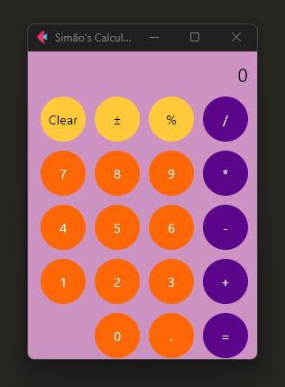

# First Calculator 

Este é um projeto simples de calculadora desenvolvido em Python utilizando a biblioteca **Flet**. A aplicação permite realizar operações matemáticas básicas, como adição, subtração, multiplicação, divisão, além de funcionalidades como limpar o cálculo, calcular percentagens e alternar sinais.🔢


## Funcionalidades✅

- **Operações básicas**: soma, subtração, multiplicação, divisão.
- **Limpar a tela**: botão "Clear" para reiniciar o cálculo.
- **Alternar sinal**: botão "±" para alternar o sinal do número.
- **Percentagem**: botão "%" para calcular o valor percentual.
- **Resultado**: botão "=" para calcular e exibir o resultado da operação.

## Tecnologias Utilizadas💻⚙️

- **Python**: Linguagem de programação principal.
- **Flet**: Biblioteca Python para criação de interfaces gráficas e aplicações interativas.
- **Git**: Controle de versão e gerenciamento do repositório.

## Como Executar o Projeto

1. **Clone o repositório**:📌

   ```bash
   git clone https://github.com/SimaoFRodrigues/FirstCalculator.git
